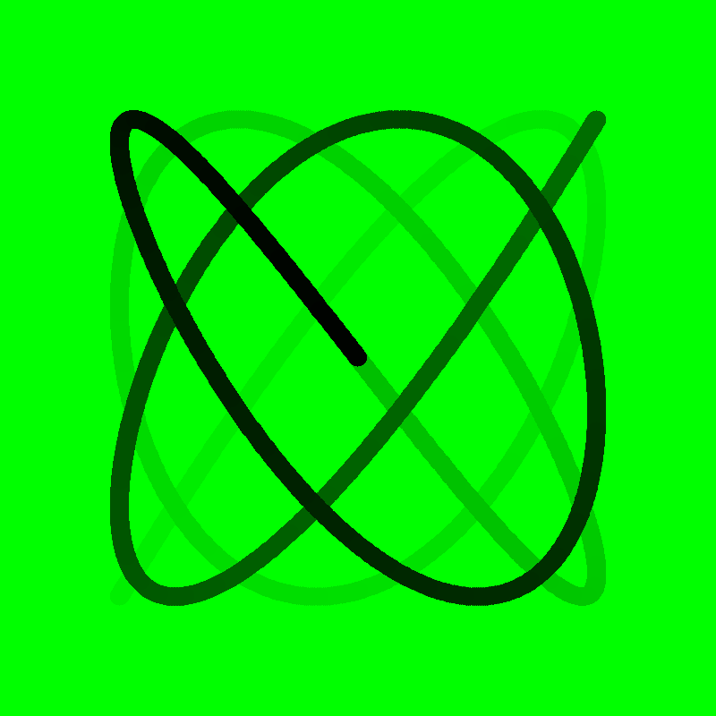

# Lissajous curve visualization script
[Wikipedia explanation](https://en.wikipedia.org/wiki/Lissajous_curve)  
[Stand-up Maths](https://youtu.be/4CbPksEl51Q?si=TFPfBXZgpglHjqVE)
## Installation
```bash
git clone git@github.com:sadracco/lissajous-curve.git
cd lissajous-curve
```
#### Using pip
```bash
pip install -r requirements.txt
python lissajous_curve.py
```
#### Using poetry
```bash
poetry install
poetry run python lissajous_curve.py
```
## Command line arguments
- `-h`, `--help`            show this help message and exit
- `-f FG`, `--fg FG`        Foreground color of the curve in hex format (eg. ff0000)
- `-b BG`, `--bg BG`        Background color in hex format (eg. 000000)
- `-t THICKNESS`, `--thickness THICKNESS` Line thickness in pixels (eg. 10)
- `-s SPEED`, `--speed SPEED` Speed (eg. 15)
- `-V VERTICAL`, `--vertical VERTICAL` Vertical frequency (eg. 5)
- `-H HORIZONTAL`, `--horizontal HORIZONTAL` Horizontal frequency (eg. 4)
- `--height HEIGHT`       Window height (eg. 800)
- `--width WIDTH`         Window width (eg. 800)
- `--npoints NPOINTS`     Number of domain points - resolution (eg. 5000)
## Examples

